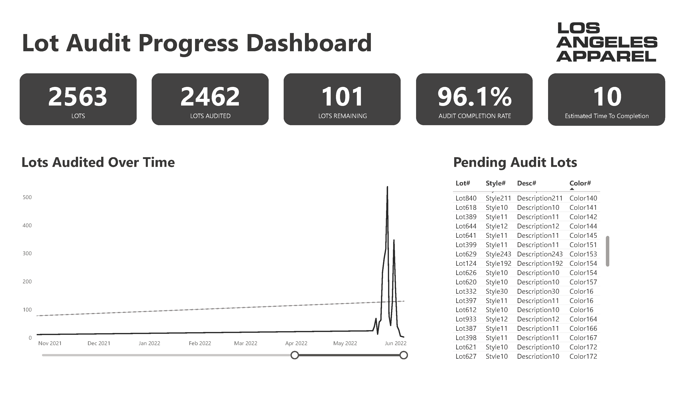

# Introduction
My goal for this project was to support Los Angeles Apparel manage there fabric inventory audit data in order to support the administrative staff in their daily operations.
# Tools
- **Excel:** Data Cleaning (Power Query)
- **Power BI:** Dashboard
# Data Cleaning and Validation
### Cleaning Process:
1. Correcting Data Types:
- Converted 'System Entry Date' and 'Received Date' to proper date formats. Encountered and corrected a date format error where the year '2020' was incorrectly entered as '0202'.
- Changed 'Received Pcs', 'Initial Stock Pcs', 'Adjusted #Pcs', and 'Final Count Pcs' to decimal numbers to reflect precise inventory counts.
2. Handling Conversion Errors:
- Addressed an error in 'Received Date' due to an incorrect entry that prevented conversion to a date type. Replaced the entry with the correct date.
- Removed non-numeric characters (e.g., "|") in 'Adjusted #Pcs' that prevented conversion to a numeric type.
3. Removing Duplicates:
- Identified and removed duplicate records based on 'Lot #' to ensure each lot is uniquely represented in the dataset.
### Discrepancies Identified:
1. Negative or Zero 'Received Pcs':
- Found instances where 'Received Pcs' were less than or equal to zero. A value less than or equal to zero doesn't make sense because it suggests that no pieces were received.
2. Negative or Zero 'Initial Stock Pcs':
- Similar to 'Received Pcs,' the 'Initial Stock Pcs' should logically be a positive number because it reflects the count of fabric pieces when initially recorded in the inventory system.
3. Negative 'Final Count Pcs':
- Observed negative values in 'Final Count Pcs.' A negative final count would suggest that more pieces were removed from the inventory than were available, which under normal circumstances, should be impossible unless there is an error.
### Data Validation Rules Implemented:
To prevent these errors from occuring in the future, I implemented these data validation rules:
1. Non-negative Inventory Counts:
- Ensured that 'Received Pcs', 'Initial Stock Pcs', and 'Final Count Pcs' cannot accept negative numbers or zero through conditional formatting rules and data validation in the spreadsheet.
2. Date Format:
- Applied data validation to ensure all date fields are entered in a consistent and correct format.
3. Duplicate Entry Prevention:
- Set up a validation rule that checks for and alerts the user to potential duplicate entries based on 'Lot #' when new data is entered into the system.
# What are your observations about this dataset?
- **Total # Unique Lots:** There are 2563 unique lots in total.
- **Unique Lots Audited:** 2462 lots have been audited, which is 96.1% of the total lots.
- **Unique Lots Remaining to be Audited:** There are 101 unique lots yet to be audited, making up 3.9% of the total lots.
- **Total Adjustments (Pcs):** The total adjustments made are -236.3 pieces, indicating a decrease and accounting for -4.3% of the total pieces when compared to the initial records.
  
The formulas can be found in the excel file 'Analysis' tab.
# Dashboard

I am sharing the dashboard as a image because I was unable to publish the dashboard to Power BI service since it requires a pro subscription or work account which I do not have.
- **Power BI Desktop File:** I will share the .pbix file, which can be downloaded and viewed using **Power BI Desktop**. Here is the file:  click on 'View Raw'

This dashboard provides a real-time overview for the inventory lot audit process. It’s designed to help the admin staff to track the current project status, identify any lots that remain to be audited, and shows the estimated remaining time to completion **(days)**.
